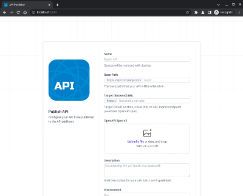

# Apigee Templater
Provides tooling for the templating and automation of Apigee proxies using simplified inputs, for example through a JSON/YAML input file, a REST call, or a CLI.

Apigee proxies are ideal for templating since the bundles are composed of simple files & directories, which can be easily automated, even for complex use-cases. This tool helps do exactly that.

## Prerequisites

* [Node.js](https://nodejs.org/) installed
* [gcloud CLI](https://cloud.google.com/sdk/gcloud) installed, and with the default project set to the Apigee X project (simply run **gcloud config set project PROJECT** to set, where **PROJECT** is your Google Cloud project).
* [gcloud CLI](https://cloud.google.com/sdk/gcloud) authenticated with  [application-default](https://cloud.google.com/sdk/gcloud/reference/auth/application-default/login) credentials (run **gcloud auth application-default login** to set in your shell, no action needed in GCP environments like Cloud Run).
* [Apigee X](https://cloud.google.com/apigee/docs/api-platform/get-started/provisioning-intro) org and environment (either eval or production).  

## Install

You can install the CLI to use globally on your system using npm. 

```sh
npm i -g apigee-templater-cli
```

You can try out the tool easily in Google Cloud Shell including a tutorial walk-through of the features by clicking here:

[](https://ssh.cloud.google.com/cloudshell/open?cloudshell_git_repo=https://github.com/apigee/apigee-templater&cloudshell_git_branch=main&cloudshell_workspace=.&cloudshell_tutorial=docs/cloudshell-tutorial.md)

## Usage

Example CLI usage:

[](https://asciinema.org/a/ZbJUQRHkmpkAZm9iWHOfGCu9T)

### Create an Apigee proxy to a web endpoint and deploy to the 'eval' environment

```sh
apigee-template -n HttpBinProxy -b /httpbin -t https://httpbin.org -d -e eval
```
Output:
```sh
# Proxy bundle generated and deployed to environment "eval"
> Proxy HttpBinProxy generated to ./HttpBinProxy.zip in 32 milliseconds.
> Proxy HttpBinProxy version 1 deployed to environment eval in 2258 milliseconds.
> Wait 2-3 minutes, then test here: https://eval-group.34-111-104-118.nip.io/httpbin
```

### Create and deploy a proxy to a BigQuery table

```sh
# Build and deploy a REST proxy to the BigQuery Austin bikesharing public dataset
apigee-template -n BikeTrips-v1 -b /trips -q bigquery-public-data.austin_bikeshare.bikeshare_trips -d -e eval -s serviceaccount@project.iam.gserviceaccount.com
```

Output:
```sh
# Proxy bundle was generated and deployed to environment "eval" with service identity
> Proxy BikeTrips-v1 generated to ./BikeTrips-v1.zip in 42 milliseconds.
> Proxy BikeTrips-v1 version 1 deployed to environment eval in 3267 milliseconds.
> Wait 2-3 minutes, then test here: https://eval-group.34-111-104-118.nip.io/trips
```
After waiting a few minutes, you can run **curl https://eval-group.34-111-104-118.nip.io/trips?pageSize=1** and get bike trip data returned, with URL parameters **pageSize**, **filter**, **orderBy** and **pageToken**.

```sh
{
  "trips": [
    {
      "trip_id": "9900289692",
      "subscriber_type": "Walk Up",
      "bikeid": "248",
      "start_time": "1.443820321E9",
      "start_station_id": "1006",
      "start_station_name": "Zilker Park West",
      "end_station_id": "1008",
      "end_station_name": "Nueces @ 3rd",
      "duration_minutes": "39"
    }
  ],
  "next_page_token": 2
}
```

### Use the CLI either in command or interactive mode

```sh
#Use the CLI in interactive mode to collect inputs
apigee-template
> Welcome to apigee-template, use -h for more command line options. 
? What should the proxy be called? MyProxy
? Which base path should be used? /test
? Which backend target should be called? https://test.com
? Do you want to deploy the proxy to an Apigee X environment? No
> Proxy MyProxy generated to ./MyProxy.zip in 60 milliseconds.
```
```sh
#Show all commands
apigee-template -h
```
```sh
#Generate a proxy based on httpbin.json and deploy it to environment test1 with credentials in key.json
apigee-template -f ./samples/httpbin.json -d -e test1
```

All deployed proxies can then be viewed and managed in the [Apigee console](https://apigee.google.com), where you can check the status of the deployments, do tracing, and create API products based on these automated proxies.

## Supported Features

The module & CLI can generate and deploy Apigee X proxies with these features out-of-the-box, and can be extended with new features easily (see "Extending & Customizing" section below).

* Proxy name
* Base path
* Targets
  * HTTP Urls
  * BigQuery Queries
  * BigQuery Tables
* Auth with apikey or 3rd party OAuth token
* Quotas
* Spike Arrests

The templating engine uses the [Handlebars](https://handlebarsjs.com/) framework to build any type of proxy based on structured inputs.  And because the logic is contained in Javascript or Typescript plugins, logic can be added for any type of requirement.

## REST service and web client



A sample [REST service](/service) and [web client](/client) show how the Apigee Templater can be used to template and deploy proxies directly from users interacting in a client.

To build and run the service and web client locally:

```sh
# Build and copy the client outputs to the service 
./build_service.sh
# Run service
cd service
node dist
```
Then you can open the service locally at [http://localhost:8080](http://localhost:8080).

You can also build and deploy the service to [Cloud Run](https://cloud.google.com/run) by clicking here:

[](https://deploy.cloud.run)

## Extending and usage in code

The project is designed to be extensible. All templating and proxy generation is done in Typescript/Javascript plugins, which can be extended or replaced based on the templating requirements.

### Usage with Typescript/Javascript
First install and import into your project.
```bash
npm install apigee-templater-module
```
Then use the generator module to build proxies.

```ts
import {ApigeeTemplateInput, ApigeeGenerator, proxyTypes, authTypes} from 'apigee-templater-module'

apigeeTemplater: ApigeeGenerator = new ApigeeGenerator(); // Optionally custom conversion plugins can be passed here, defaults are included.

let input: ApigeeTemplateInput = {
  name: "MyProxy",
  endpoints: [
    {
      name: "default",
      basePath: "/myproxy",
      target: {
        name: "default",
        url: "https://httpbin.org"
      },
      quotas: [
        {
          count: 200,
          timeUnit: "day"
        }
      ],
      auth: [
        {
          type: authTypes.apikey
        }
      ]
    }
  ]
}

apigeeGenerator.generateProxy(input, "./proxies").then((result) => {
  // Proxy bundle generated to ./proxies/MyProxy.zip
  console.log(`Proxy successfully generated to ${result.localPath}!`);
});

```
### Customizing plugins

You can change / write your own plugins (see /module/lib/plugins), and then inject them when instantiating the **ApigeeGenerator** service object.

```typescript
  // Pass an array of template and input converter plugins that are used at runtime.
  apigeeGenerator: ApigeeTemplateService = new ApigeeGenerator(
    {
      "default": [
        new SpikeArrestPlugin(),
        new AuthApiKeyPlugin(),
        new AuthSfPlugin(),
        new QuotaPlugin(),
        new TargetsPlugin(),
        new ProxiesPlugin(),
      ]
    });
```
The above plugins are delivered in the **apigee-templater-module** package, but you can easily write your own by implementing the **ApigeeTemplatePlugin** interface (see /module/lib/plugins for examples). 

When generating proxies, the plugins are called in the order given above, and proceed to create the proxy package for their particular task (spike arrest, key validation, etc..).

### CLI script customization

You can customize the CLI directly without changing the **ApigeeGenerator** object by adding a javascript script using the **-s** parameter when calling the **apigee-template** CLI.  This script is evaluated before the templating is done, and can make changes to the **ApigeeGenerator** object as needed, by for example removing, replacing or adding plugins for both templating and input conversion (see [/samples/script.js](/samples/script.js) for an example).

```bash
# Create a proxy based on ./samples/httpbin.json using customization script ./samples/script.js,
# which replaces the generic **QuotaPlugin** with a developer-specific **DevQuotaPlugin**
apigee-template -f ./samples/httpbin.json -s ./samples/script.js
```

## Contributing

See the [contributing instructions](./CONTRIBUTING.md) to get started.

## License

All solutions within this repository are provided under the
[Apache 2.0](https://www.apache.org/licenses/LICENSE-2.0) license.
Please see the [LICENSE](./LICENSE) file for more detailed terms and conditions.

## Disclaimer

This repository and its contents are not an official Google product.

